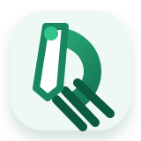
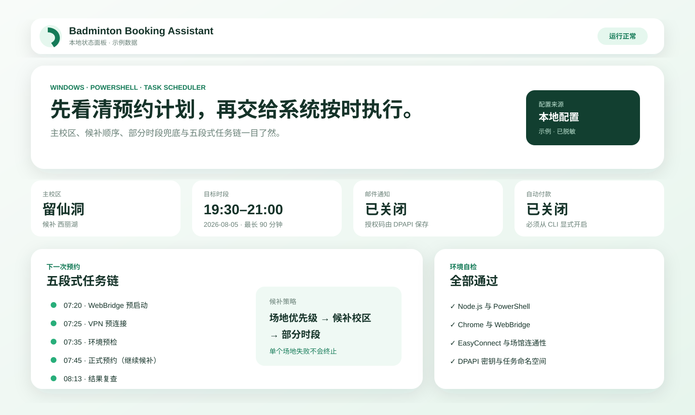

<p align="center"></p>
<h1 align="center">Badminton Booking Assistant</h1>
<p align="center">Windows automation for scheduled badminton court booking, with preflight checks and resilient fallbacks.</p>
<p align="center"><a href="README.md">中文</a> · <a href="docs/en/installation.md">Install</a> · <a href="docs/en/configuration.md">Configure</a> · <a href="docs/en/troubleshooting.md">Troubleshoot</a></p>



## Quick start

```powershell
git clone https://github.com/lifelinezzz90-cmd/badminton-booking-assistant.git
cd badminton-booking-assistant
.\badminton.ps1 setup
.\badminton.ps1 doctor
.\badminton.ps1 schedule -TargetDate 2026-07-29 -Start 19:30 -End 21:00 -PlanOnly
```

Do not edit JSON for the first run. `setup` explains each prompt: use the unified-login/CAS account you normally use for the booking system (often a student or staff ID), then enter its password in the hidden prompt. The password is DPAPI-protected and is never stored in `config/local.json`. EasyConnect is detected from the Start Menu; if discovery fails, a `.lnk` file picker opens automatically.

To change the password later, run `.\badminton.ps1 config -UpdatePassword`. To select the VPN shortcut again, run `.\badminton.ps1 config -SelectVpnShortcut`.

Remove `-PlanOnly` only after reviewing the five-task preview.

## Highlights

- One CLI for setup, diagnostics, scheduling, status, configuration, dashboard, and uninstall.
- Campus, court-priority, and partial-duration fallbacks remain active after individual failures.
- One canonical configuration resolver shared by PowerShell, Node.js, and the dashboard.
- Mail and automatic payment are off by default; secrets use Windows DPAPI.
- Existing 46-field flat configuration files remain supported.

## Compatibility

The first release targets Windows, PowerShell 5.1+, Node.js 20+, Chrome, Kimi WebBridge, EasyConnect, and the currently adapted venue system. It is not a universal booking framework.

This is an unofficial community project and is not affiliated with any venue, institution, VPN provider, or browser-extension provider.

## Documentation

- [Installation](docs/en/installation.md)
- [Configuration](docs/en/configuration.md)
- [Troubleshooting](docs/en/troubleshooting.md)
- [Architecture](docs/en/architecture.md)
- [Security model](docs/en/security.md)

See [CONTRIBUTING.md](CONTRIBUTING.md), [SECURITY.md](SECURITY.md), and the [MIT License](LICENSE).
